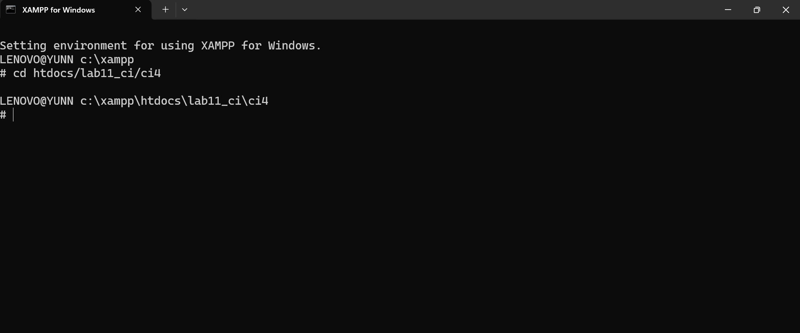
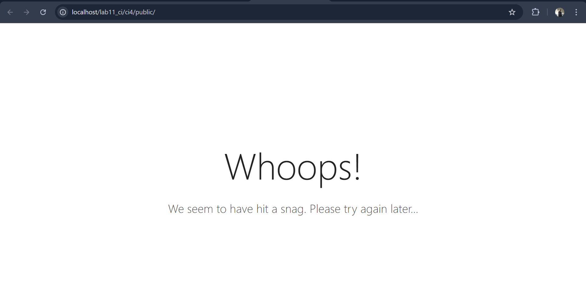
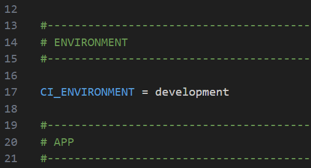
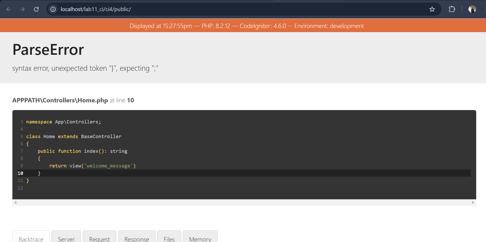
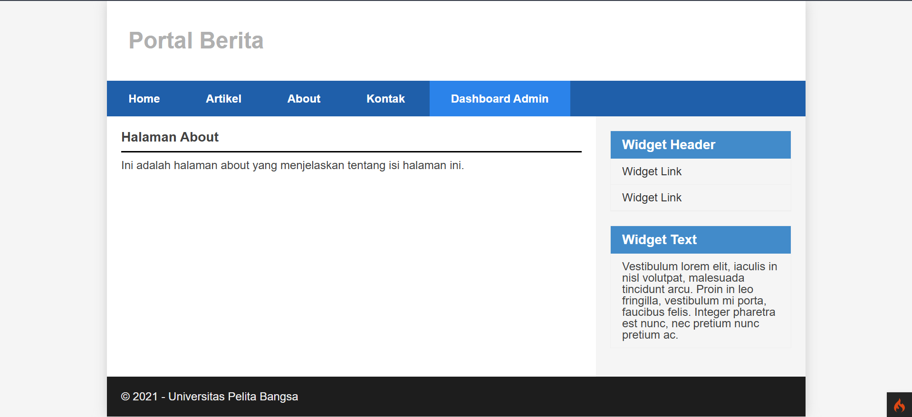
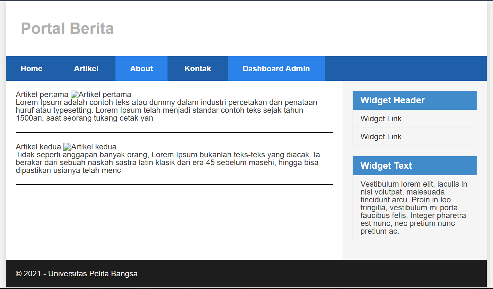
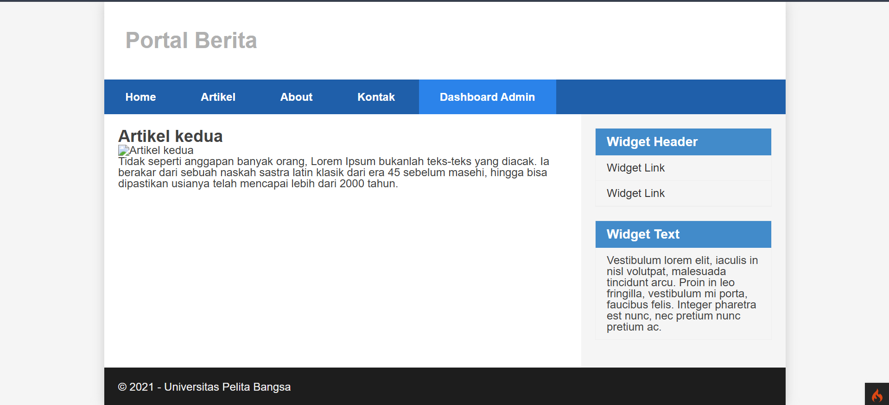

# Pertemuan ke 1 - 3 

## Profil
|  |  |
| -------- | --- |
| **Nama** | Muhammad Nurul Firdaus |
| **Kelas** | TI.23.A.5 |
| **Mata Kuliah** | Pemrograman Web 2 |

# Praktikum 1: PHP Framework (Codeigniter)

## Langkah-langkah Praktikum
## Persiapan
Sebelum memulai menggunakan Framework Codeigniter, perlu dilakukan konfigurasi pada webserver. Beberapa ekstensi PHP perlu diaktifkan untuk kebutuhan pengembangan Codeigniter 4.
Berikut beberapa ekstensi yang perlu diaktifkan:
* php-json ekstension untuk bekerja dengan JSON;
* php-mysqlnd native driver untuk MySQL;
* php-xml ekstension untuk bekerja dengan XML;
* php-intl ekstensi untuk membuat aplikasi multibahasa;
* libcurl (opsional), jika ingin pakai Curl.

Untuk mengetahui ekstensi tersebut telah aktif atau belum, kita bisa mengetahui nya melalui powershell atau command prompt dengan cara:

### Catatan : mulai dari PHP 7.0, ekstensi JSON biasanya sudah termasuk secara bawaan.


Lalu kalian bisa mencari ekstensi yang kalian butuhkan, jika ada yang belum diaktivasi kalian dapat mengaktifkan ekstensi tersebut, melalu XAMPP Control Panel, pada bagian Apache
klik Config -> PHP.ini :


* Contohnya disini extension=intl belum aktif, maka cara mengaktivasinya adalah dengan menghilangkan tanda ; (titik koma) pada ekstensi yang akan diaktifkan. Kemudian simpan kembali filenya dan restart Apache web server.

## Instalasi Codeigniter 4
Untuk melakukan instalasi Codeigniter 4 dapat dilakukan dengan dua cara, yaitu cara manual
dan menggunakan composer. Pada praktikum ini kita menggunakan cara manual.
* Unduh Codeigniter dari website https://codeigniter.com/download
* Extrak file zip Codeigniter ke direktori htdocs/lab11_ci.
* Ubah nama direktory codeigniter4-framework-v4.x.xx menjadi ci4.
* Buka browser dengan alamat http://localhost/lab11_ci/ci4/public/


## Menjalankan CLI (Command Line Interface)
Codeigniter 4 menyediakan CLI untuk mempermudah proses development. Untuk mengakses CLI buka Shell pada XAMPP.



Arahkan lokasi direktori sesuai dengan direktori kerja project dibuat (Contoh : cd htdocs/lab11_ci/ci4)

Perintah yang dapat dijalankan untuk memanggil CLI Codeigniter adalah:

### php spark


## Mengaktifkan Mode Debugging
Codeigniter 4 menyediakan fitur debugging untuk memudahkan developer untuk mengetahui pesan error apabila terjadi kesalahan dalam membuat kode program.

Secara default fitur ini belum aktif. Ketika terjadi error pada aplikasi akan ditampilkan pesan kesalahan seperti berikut.



Semua jenis error akan ditampilkan sama. Untuk memudahkan mengetahui jenis errornya,
maka perlu diaktifkan mode debugging dengan mengubah nilai konfigurasi pada environment
variable CI_ENVIRONMENT menjadi development.


Ubah nama file env menjadi .env kemudian buka file tersebut dan ubah nilai variable
CI_ENVIRONMENT menjadi development.
#### Catatan : Kadang, CodeIgniter tidak membaca file .env karena masih dikomentari, pastikan tidak ada tanda # di depan CI_ENVIRONMENT.



Contoh error yang terjadi. Untuk mencoba error tersebut, ubah kode pada file
app/Controller/Home.php hilangkan titik koma pada akhir kode return view('welcome_message').


## Memahami konsep MVC
Codeigniter menggunakan konsep MVC. MVC meripakan singkatan dari Model-View-
Controller. MVC merupakan konsep arsitektur yang umum digunakan dalam pengembangan aplikasi. Konsep MVC adalah memisahkan kode program berdasarkan logic proses, data, dan
tampilan. Untuk logic proses diletakkan pada direktori Contoller, Objek data diletakkan pada direktori Model, dan desain tampilan diletakkan pada direktori View.

Codeigniter menggunakan konsep pemrograman berorientasi objek dalam mengimplementasikan konsep MVC.

Model merupakan kode program yang berisi pemodelan data. Data dapat berupa database ataupun sumber lainnya.

View merupakan kode program yang berisi bagian yang menangani terkait tampilan user interface sebuah aplikasi. didalam aplikasi web biasanya pasti akan berhubungan dengan html dan css.

Controller merupakaan kode program yang berkaitan dengan logic proses yang menghubungkan antara view dan model. Controller berfungsi untuk menerima request dan data dari user kemudian diproses dengan menghubungkan bagian model dan view.

## Routing dan Controller
Routing merupakan proses yang mengatur arah atau rute dari request untuk menentukan fungsi/bagian mana yang akan memproses request tersebut. Pada framework CI4, routing bertujuan untuk menentukan Controller mana yang harus merespon sebuah request. Controller
adalah class atau script yang bertanggung jawab merespon sebuah request.

Pada Codeigniter, request yang diterima oleh file index.php akan diarahkan ke Router untuk
meudian oleh router tesebut diarahkan ke Controller.

Router terletak pada file app/config/Routes.php


Pada file tersebut kita dapat mendefinisikan route untuk aplikasi yang kita buat.
Contoh:
```` sql
$routes->get('/', 'Home::index');
````
Kode tersebut akan mengarahkan rute untuk halaman home.

#### Membuat Route Baru.
Tambahkan kode berikut di dalam Routes.php
```` sql
$routes->get('/about', 'Page::about');
$routes->get('/contact', 'Page::contact');
$routes->get('/faqs', 'Page::faqs');
````
Untuk mengetahui route yang ditambahkan sudah benar, buka CLI dan jalankan perintah berikut.

php spark routes


Selanjutnya coba akses route yang telah dibuat dengan mengakses alamat url http://localhost:8080/about


Ketika diakses akan mucul tampilan error 404 file not found, itu artinya file/page tersebut tidak ada. Untuk dapat mengakses halaman tersebut, harus dibuat terlebih dahulu Contoller yang sesuai dengan routing yang dibuat yaitu Contoller Page.

#### Membuat Controller
Selanjutnya adalah membuat Controller Page. Buat file baru dengan nama page.php pada direktori Controller kemudian isi kodenya seperti berikut.

```` sql
<?php

namespace App\Controllers;

class Page extends BaseController
{
    public function about()
    {
        echo "Ini halaman About";
    }
    public function contact()
    {
        echo "Ini halaman Contact";
    }
    public function faqs()
    {
        echo "Ini halaman FAQ";
    }
}
````


#### Auto Routing
Secara default fitur autoroute pada Codeiginiter sudah aktif. Untuk mengubah status autoroute dapat mengubah nilai variabelnya. Untuk menonaktifkan ubah nilai true menjadi false.

```` sql
$routes->get('page/tos', 'Page::tos');
$routes->setAutoRoute(true);
````

Tambahkan method baru pada Controller Page seperti berikut.
```` sql
public function tos()
{
    echo "ini halaman Term of Services";
}
````

Method ini belum ada pada routing, sehingga cara mengaksesnya dengan menggunakan alamat: http://localhost:8080/page/tos


### Membuat View
Selanjutnya adalam membuat view untuk tampilan web agar lebih menarik. Buat file baru dengan nama about.php pada direktori Views (app/Views/about.php) kemudian isi kodenya seperti berikut.
```` sql
<!DOCTYPE html>
<html lang="en">

<head>
    <meta charset="UTF-8">
    <title><?= $title; ?></title>
</head>

<body>
    <h1><?= $title; ?></h1>
    <hr>
    <p><?= $content; ?></p>
</body>

</html>
````

Ubah method about pada class Controller Page menjadi seperti berikut:
``` sql
    public function about()
    {
        return view('about', [
            'title' => 'Halaman About',
            'content' => 'Ini adalah halaman about yang menjelaskan tentang isi halaman ini.'
        ]);
    }
```

Kemudian lakukan refresh pada halaman tersebut.


### Membuat Layout Web dengan CSS
Pada dasarnya layout web dengan css dapat diimplamentasikan dengan mudah pada codeigniter. Yang perlu diketahui adalah, pada Codeigniter 4 file yang menyimpan asset css dan javascript terletak pada direktori public.

Buat file css pada direktori public dengan nama style.css


Kemudian buat folder template pada direktori view kemudian buat file header.php dan footer.php

File app/Views/template/header.php
```sql
<!DOCTYPE html>
<html lang="en">

<head>
    <meta charset="UTF-8">
    <title><?= $title; ?></title>
    <link rel="stylesheet" href="<?= base_url('/style.css'); ?>">
</head>

<body>
    <div id="container">
        <header>
            <h1>Layout Sederhana</h1>
        </header>
        <nav>
            <a href="<?= base_url('/'); ?>" class="active">Home</a>
            <a href="<?= base_url('/artikel'); ?>">Artikel</a>
            <a href="<?= base_url('/about'); ?>">About</a>
            <a href="<?= base_url('/contact'); ?>">Kontak</a>
        </nav>
        <section id="wrapper">
            <section id="main"></section>
```

File app/Views/template/footer.php
```sql
</section>
<aside id="sidebar">
    <div class="widget-box">
        <h3 class="title">Widget Header</h3>
        <ul>
            <li><a href="#">Widget Link</a></li>
            <li><a href="#">Widget Link</a></li>
        </ul>
    </div>
    <div class="widget-box">
        <h3 class="title">Widget Text</h3>
        <p>Vestibulum lorem elit, iaculis in nisl volutpat,
            malesuada tincidunt arcu. Proin in leo fringilla, vestibulum mi porta,
            faucibus felis. Integer pharetra est nunc, nec pretium nunc pretium ac.</p>
    </div>
</aside>
</section>
<footer>
    <p>&copy; 2021 - Universitas Pelita Bangsa</p>
</footer>
</div>
</body>

</html>
```

Kemudian ubah file app/Views/about.php seperti berikut.
```sql
<?= $this->include('template/header'); ?>
<h1><?= $title; ?></h1>
<hr>
<p><?= $content; ?></p>
<?= $this->include('template/footer'); ?>
```

Selanjutnya refresh tampilan pada alamat http://localhost:8080/about


# Praktikum 2: Framework Lanjutan (CRUD) - CodeIgniter 4

## Tujuan Praktikum
1. Memahami konsep dasar Model.
2. Memahami konsep dasar CRUD.
3. Membuat program sederhana menggunakan Framework CodeIgniter 4.

## Persiapan
- Gunakan text editor seperti VSCode.
- Buka folder `lab7_php_ci` pada docroot webserver (htdocs).
- Jalankan XAMPP dan pastikan MySQL Server aktif.

## Langkah-Langkah

### Membuat Database

```sql
CREATE DATABASE lab_ci4;
```
```sql
CREATE TABLE artikel (
  id INT(11) auto_increment,
  judul VARCHAR(200) NOT NULL,
  isi TEXT,
  gambar VARCHAR(200),
  status TINYINT(1) DEFAULT 0,
  slug VARCHAR(200),
  PRIMARY KEY(id)
);
```

### Konfigurasi Koneksi Database
- Gunakan file .env dan atur parameter koneksi database sesuai kebutuhan.


### Membuat Model
- Selanjutnya adalah membuat Model untuk memproses data Artikel. Buat file baru pada
direktori app/Models dengan nama ArtikelModel.php
```sql
<?php
namespace App\Models;

use CodeIgniter\Model;

class ArtikelModel extends Model
{
    protected $table = 'artikel';
    protected $primaryKey = 'id';
    protected $useAutoIncrement = true;
    protected $allowedFields = ['judul', 'isi', 'status', 'slug', 'gambar'];
}
```
### Membuat Controller
- Buat Controller baru dengan nama Artikel.php pada direktori app/Controllers.
```sql
<?php

namespace App\Controllers;

use App\Models\ArtikelModel;

class Artikel extends BaseController
{
    public function index()
    {
        $title = 'Daftar Artikel';
        $model = new ArtikelModel();
        $artikel = $model->findAll();
        return view('artikel/index', compact('artikel', 'title'));
    }
}
```
### Membuat View
- Buat direktori baru dengan nama artikel pada direktori app/views, kemudian buat file baru
dengan nama index.php.
```sql
<?= $this->include('template/header'); ?>

<?php if($artikel): foreach($artikel as $row): ?>
<article class="entry">
    <h2<a href="<?= base_url('/artikel/' . $row['slug']);?>"><?= $row['judul']; ?></a>
</h2>
    " alt="<?= $row['judul']; ?>">
    <p><?= substr($row['isi'], 0, 200); ?></p>
</article>
<hr class="divider" />
<?php endforeach; else: ?>
<article class="entry">
    <h2>Belum ada data.</h2>
</article>
<?php endif; ?>

<?= $this->include('template/footer'); ?>
```
Selanjutnya buka browser kembali, dengan mengakses url http://localhost:8080/artikel

Belum ada data yang diampilkan. Kemudian coba tambahkan beberapa data pada database agar dapat ditampilkan datanya.
```sql
INSERT INTO artikel (judul, isi, slug) VALUE
('Artikel pertama', 'Lorem Ipsum adalah contoh teks atau dummy dalam industri percetakan dan penataan huruf atau typesetting. Lorem Ipsum telah menjadi standar contoh teks sejak tahun 1500an, saat seorang tukang cetak yang tidak dikenal mengambil sebuah kumpulan teks dan mengacaknya untuk menjadi sebuah buku contoh huruf.','artikel-pertama'),
('Artikel kedua', 'Tidak seperti anggapan banyak orang, Lorem Ipsum bukanlah teks-teks yang diacak. Ia berakar dari sebuah naskah sastra latin klasik dari era 45 sebelum masehi, hingga bisa dipastikan usianya telah mencapai lebih dari 2000 tahun.', 'artikel-kedua');
```
Refresh kembali browser, sehingga akan ditampilkan hasilnya.

### Membuat Tampilan Detail Artikel
Tampilan pada saat judul berita di klik maka akan diarahkan ke halaman yang berbeda. Tambahkan fungsi baru pada Controller Artikel dengan nama view().
```sql
public function view($slug)
{
    $model = new ArtikelModel();
    $artikel = $model->where([
        'slug' => $slug
    ])->first();

    // Menampilkan error apabila data tidak ada.
    if (!$artikel)
    {
        throw PageNotFoundException::forPageNotFound();
    }

    $title = $artikel['judul'];
    return view('artikel/detail', compact('artikel', 'title'));
}
```
### Membuat View Detail
- Buat view baru untuk halaman detail dengan nama app/views/artikel/detail.php.
```sql
<?= $this->include('template/header'); ?>

<article class="entry">
    <h2><?= $artikel['judul']; ?></h2>
    " alt="<?=
$artikel['judul']; ?>">
    <p><?= $row['isi']; ?></p>
</article>

<?= $this->include('template/footer'); ?>
```
### Membuat Routing untuk artikel detail
- Buka Kembali file app/config/Routes.php, kemudian tambahkan routing untuk artikel detail.
```sql
$routes->get('/artikel/(:any)', 'Artikel::view/$1');
```

### Membuat Menu Admin
Menu admin adalah untuk proses CRUD data artikel. Buat method baru pada Controller Artikel dengan nama admin_index().
```sql
public function admin_index()
{
    $title = 'Daftar Artikel';
    $model = new ArtikelModel();
    $artikel = $model->findAll();
    return view('artikel/admin_index', compact('artikel', 'title'));
}
```

Selanjutnya buat view untuk tampilan admin dengan nama admin_index.php
```sql
<?= $this->include('template/admin_header'); ?>

<table class="table">
    <thead>
        <tr>
            <th>ID</th>
            <th>Judul</th>
            <th>Status</th>
            <th>AKsi</th>
        </tr>
    </thead>
    <tbody>
    <?php if($artikel): foreach($artikel as $row): ?>
    <tr>
        <td><?= $row['id']; ?></td>
        <td>
            <b><?= $row['judul']; ?></b>
            <p><small><?= substr($row['isi'], 0, 50); ?></small></p>
        </td>
        <td><?= $row['status']; ?></td>
        <td>
            <a class="btn" href="<?= base_url('/admin/artikel/edit/' . $row['id']);?>">Ubah</a>
            <a class="btn btn-danger" onclick="return confirm('Yakin menghapus data?');" href="<?= base_url('/admin/artikel/delete/' . $row['id']);?>">Hapus</a>
        </td>
    </tr>
    <?php endforeach; else: ?>
    <tr>
        <td colspan="4">Belum ada data.</td>
    </tr>
    <?php endif; ?>
    </tbody>
    <tfoot>
        <tr>
            <th>ID</th>
            <th>Judul</th>
            <th>Status</th>
            <th>AKsi</th>
        </tr>
    </tfoot>
</table>

<?= $this->include('template/admin_footer'); ?>
```
Tambahkan routing untuk menu admin seperti berikut:
```sql
$routes->group('admin', function($routes) {
    $routes->get('artikel', 'Artikel::admin_index');
    $routes->add('artikel/add', 'Artikel::add');
    $routes->add('artikel/edit/(:any)', 'Artikel::edit/$1');
    $routes->get('artikel/delete/(:any)', 'Artikel::delete/$1');
});
```
Akses menu admin dengan url http://localhost:8080/admin/artikel

### Menambah Data Artikel
Tambahkan fungsi/method baru pada Controller Artikel dengan nama add().
```sql
public function add()
{
    // validasi data.
    $validation = \Config\Services::validation();
    $validation->setRules(['judul' => 'required']);
    $isDataValid = $validation->withRequest($this->request)->run();

    if ($isDataValid)
    {
        $artikel = new ArtikelModel();
        $artikel->insert([
            'judul' => $this->request->getPost('judul'),
            'isi' => $this->request->getPost('isi'),
            'slug' => url_title($this->request->getPost('judul')),
        ]);
        return redirect('admin/artikel');
    }
    $title = "Tambah Artikel";
    return view('artikel/form_add', compact('title'));
}
```
Kemudian buat view untuk form tambah dengan nama form_add.php
```sql
<?= $this->include('template/admin_header'); ?>

<h2><?= $title; ?></h2>
<form action="" method="post">
    <p>
        <input type="text" name="judul">
    </p>
    <p>
        <textarea name="isi" cols="50" rows="10"></textarea>
    </p>
    <p><input type="submit" value="Kirim" class="btn btn-large"></p>
</form>

<?= $this->include('template/admin_footer'); ?>
```
### Mengubah Data
Tambahkan fungsi/method baru pada Controller Artikel dengan nama edit().
```sql
public function edit($id)
{
    $artikel = new ArtikelModel();

    // validasi data.
    $validation = \Config\Services::validation();
    $validation->setRules(['judul' => 'required']);
    $isDataValid = $validation->withRequest($this->request)->run();

    if ($isDataValid)
    {
        $artikel->update($id, [
            'judul' => $this->request->getPost('judul'),
            'isi' => $this->request->getPost('isi'),
        ]);
        return redirect('admin/artikel');
    }

    // ambil data lama
    $data = $artikel->where('id', $id)->first();
    $title = "Edit Artikel";
    return view('artikel/form_edit', compact('title', 'data'));
}
```
Kemudian buat view untuk form tambah dengan nama form_edit.php
```sql
<?= $this->include('template/admin_header'); ?>

<h2><?= $title; ?></h2>
<form action="" method="post">
    <p>
        <input type="text" name="judul" value="<?= $data['judul'];?>" >
    </p>
    <p>
        <textarea name="isi" cols="50" rows="10"><?=$data['isi'];?></textarea>
    </p>
    <p><input type="submit" value="Kirim" class="btn btn-large"></p>
</form>

<?= $this->include('template/admin_footer'); ?>
```
### Menghapus Data
Tambahkan fungsi/method baru pada Controller Artikel dengan nama delete().
```sql
public function delete($id)
{
    $artikel = new ArtikelModel();
    $artikel->delete($id);
    return redirect('admin/artikel');
}
```