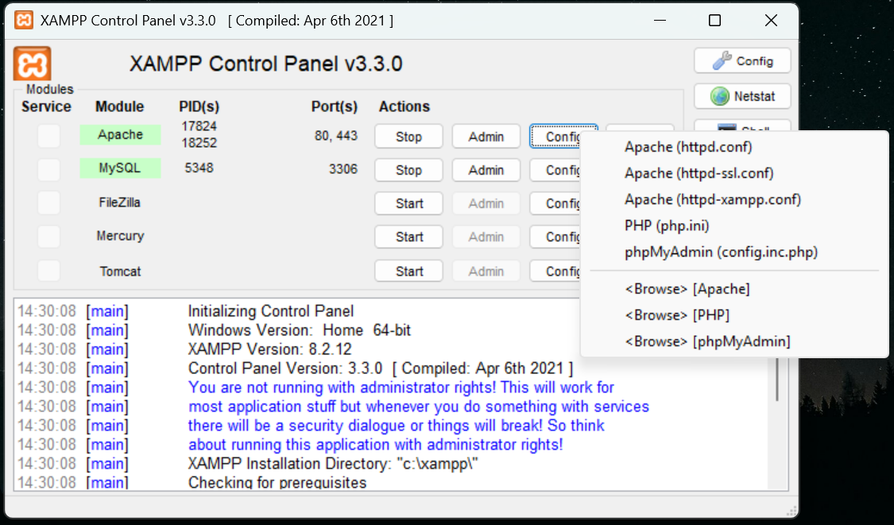
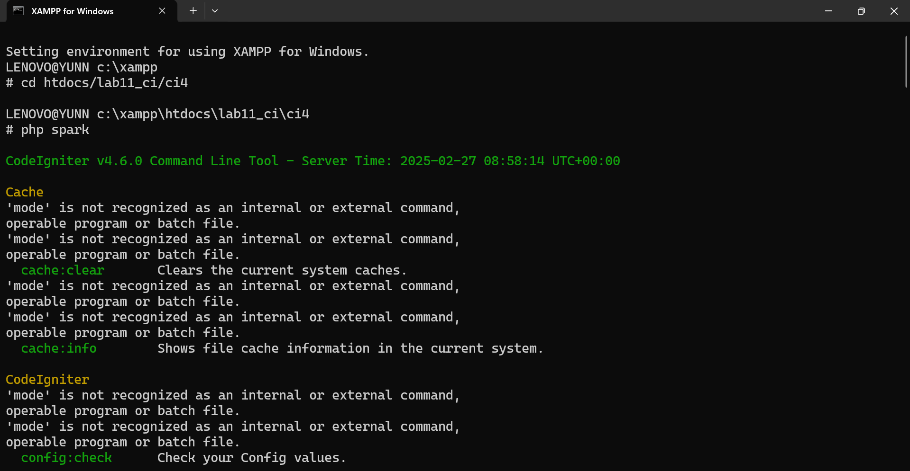
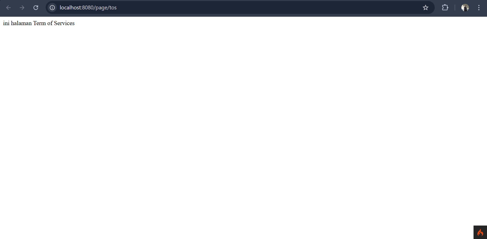

# Pertemuan ke 2 

## Profil
|  |  |
| -------- | --- |
| **Nama** | Muhammad Nurul Firdaus |
| **Kelas** | TI.23.A.5 |
| **Mata Kuliah** | Pemrograman Web 2 |

# Praktikum 1: PHP Framework (Codeigniter)

## Langkah-langkah Praktikum
## Persiapan
Sebelum memulai menggunakan Framework Codeigniter, perlu dilakukan konfigurasi pada webserver. Beberapa ekstensi PHP perlu diaktifkan untuk kebutuhan pengembangan Codeigniter 4.
Berikut beberapa ekstensi yang perlu diaktifkan:
* php-json ekstension untuk bekerja dengan JSON;
* php-mysqlnd native driver untuk MySQL;
* php-xml ekstension untuk bekerja dengan XML;
* php-intl ekstensi untuk membuat aplikasi multibahasa;
* libcurl (opsional), jika ingin pakai Curl.

Untuk mengetahui ekstensi tersebut telah aktif atau belum, kita bisa mengetahui nya melalui powershell atau command prompt dengan cara:

### Catatan : mulai dari PHP 7.0, ekstensi JSON biasanya sudah termasuk secara bawaan.


Lalu kalian bisa mencari ekstensi yang kalian butuhkan, jika ada yang belum diaktivasi kalian dapat mengaktifkan ekstensi tersebut, melalu XAMPP Control Panel, pada bagian Apache
klik Config -> PHP.ini :




* Contohnya disini extension=intl belum aktif, maka cara mengaktivasinya adalah dengan menghilangkan tanda ; (titik koma) pada ekstensi yang akan diaktifkan. Kemudian simpan kembali filenya dan restart Apache web server.

## Instalasi Codeigniter 4
Untuk melakukan instalasi Codeigniter 4 dapat dilakukan dengan dua cara, yaitu cara manual
dan menggunakan composer. Pada praktikum ini kita menggunakan cara manual.
* Unduh Codeigniter dari website https://codeigniter.com/download
* Extrak file zip Codeigniter ke direktori htdocs/lab11_ci.
* Ubah nama direktory codeigniter4-framework-v4.x.xx menjadi ci4.
* Buka browser dengan alamat http://localhost/lab11_ci/ci4/public/


## Menjalankan CLI (Command Line Interface)
Codeigniter 4 menyediakan CLI untuk mempermudah proses development. Untuk mengakses CLI buka Shell pada XAMPP.


Arahkan lokasi direktori sesuai dengan direktori kerja project dibuat (Contoh : cd htdocs/lab11_ci/ci4)

Perintah yang dapat dijalankan untuk memanggil CLI Codeigniter adalah:

### php spark


## Mengaktifkan Mode Debugging
Codeigniter 4 menyediakan fitur debugging untuk memudahkan developer untuk mengetahui pesan error apabila terjadi kesalahan dalam membuat kode program.

Secara default fitur ini belum aktif. Ketika terjadi error pada aplikasi akan ditampilkan pesan kesalahan seperti berikut.


Semua jenis error akan ditampilkan sama. Untuk memudahkan mengetahui jenis errornya,
maka perlu diaktifkan mode debugging dengan mengubah nilai konfigurasi pada environment
variable CI_ENVIRONMENT menjadi development.


Ubah nama file env menjadi .env kemudian buka file tersebut dan ubah nilai variable
CI_ENVIRONMENT menjadi development.
#### Catatan : Kadang, CodeIgniter tidak membaca file .env karena masih dikomentari, pastikan tidak ada tanda # di depan CI_ENVIRONMENT.


Contoh error yang terjadi. Untuk mencoba error tersebut, ubah kode pada file
app/Controller/Home.php hilangkan titik koma pada akhir kode return view('welcome_message').


## Memahami konsep MVC
Codeigniter menggunakan konsep MVC. MVC meripakan singkatan dari Model-View-
Controller. MVC merupakan konsep arsitektur yang umum digunakan dalam pengembangan aplikasi. Konsep MVC adalah memisahkan kode program berdasarkan logic proses, data, dan
tampilan. Untuk logic proses diletakkan pada direktori Contoller, Objek data diletakkan pada direktori Model, dan desain tampilan diletakkan pada direktori View.

Codeigniter menggunakan konsep pemrograman berorientasi objek dalam mengimplementasikan konsep MVC.

Model merupakan kode program yang berisi pemodelan data. Data dapat berupa database ataupun sumber lainnya.

View merupakan kode program yang berisi bagian yang menangani terkait tampilan user interface sebuah aplikasi. didalam aplikasi web biasanya pasti akan berhubungan dengan html dan css.

Controller merupakaan kode program yang berkaitan dengan logic proses yang menghubungkan antara view dan model. Controller berfungsi untuk menerima request dan data dari user kemudian diproses dengan menghubungkan bagian model dan view.

## Routing dan Controller
Routing merupakan proses yang mengatur arah atau rute dari request untuk menentukan fungsi/bagian mana yang akan memproses request tersebut. Pada framework CI4, routing bertujuan untuk menentukan Controller mana yang harus merespon sebuah request. Controller
adalah class atau script yang bertanggung jawab merespon sebuah request.

Pada Codeigniter, request yang diterima oleh file index.php akan diarahkan ke Router untuk
meudian oleh router tesebut diarahkan ke Controller.

Router terletak pada file app/config/Routes.php


Pada file tersebut kita dapat mendefinisikan route untuk aplikasi yang kita buat.
Contoh:
```` python
$routes->get('/', 'Home::index');
````
Kode tersebut akan mengarahkan rute untuk halaman home.

#### Membuat Route Baru.
Tambahkan kode berikut di dalam Routes.php
```` python
$routes->get('/about', 'Page::about');
$routes->get('/contact', 'Page::contact');
$routes->get('/faqs', 'Page::faqs');
````
Untuk mengetahui route yang ditambahkan sudah benar, buka CLI dan jalankan perintah berikut.

php spark routes


Selanjutnya coba akses route yang telah dibuat dengan mengakses alamat url http://localhost:8080/about


Ketika diakses akan mucul tampilan error 404 file not found, itu artinya file/page tersebut tidak ada. Untuk dapat mengakses halaman tersebut, harus dibuat terlebih dahulu Contoller yang sesuai dengan routing yang dibuat yaitu Contoller Page.

#### Membuat Controller
Selanjutnya adalah membuat Controller Page. Buat file baru dengan nama page.php pada direktori Controller kemudian isi kodenya seperti berikut.

```` python
<?php

namespace App\Controllers;

class Page extends BaseController
{
    public function about()
    {
        echo "Ini halaman About";
    }
    public function contact()
    {
        echo "Ini halaman Contact";
    }
    public function faqs()
    {
        echo "Ini halaman FAQ";
    }
}
````


#### Auto Routing
Secara default fitur autoroute pada Codeiginiter sudah aktif. Untuk mengubah status autoroute dapat mengubah nilai variabelnya. Untuk menonaktifkan ubah nilai true menjadi false.

```` python
$routes->get('page/tos', 'Page::tos');
$routes->setAutoRoute(true);
````

Tambahkan method baru pada Controller Page seperti berikut.
```` python
public function tos()
{
    echo "ini halaman Term of Services";
}
````

Method ini belum ada pada routing, sehingga cara mengaksesnya dengan menggunakan alamat: http://localhost:8080/page/tos


### Membuat View
Selanjutnya adalam membuat view untuk tampilan web agar lebih menarik. Buat file baru dengan nama about.php pada direktori Views (app/Views/about.php) kemudian isi kodenya seperti berikut.
```` python
<!DOCTYPE html>
<html lang="en">

<head>
    <meta charset="UTF-8">
    <title><?= $title; ?></title>
</head>

<body>
    <h1><?= $title; ?></h1>
    <hr>
    <p><?= $content; ?></p>
</body>

</html>
````

Ubah method about pada class Controller Page menjadi seperti berikut:
``` python
    public function about()
    {
        return view('about', [
            'title' => 'Halaman About',
            'content' => 'Ini adalah halaman about yang menjelaskan tentang isi halaman ini.'
        ]);
    }
```

Kemudian lakukan refresh pada halaman tersebut.


### Membuat Layout Web dengan CSS
Pada dasarnya layout web dengan css dapat diimplamentasikan dengan mudah pada codeigniter. Yang perlu diketahui adalah, pada Codeigniter 4 file yang menyimpan asset css dan javascript terletak pada direktori public.

Buat file css pada direktori public dengan nama style.css


Kemudian buat folder template pada direktori view kemudian buat file header.php dan footer.php

File app/Views/template/header.php
```python
<!DOCTYPE html>
<html lang="en">

<head>
    <meta charset="UTF-8">
    <title><?= $title; ?></title>
    <link rel="stylesheet" href="<?= base_url('/style.css'); ?>">
</head>

<body>
    <div id="container">
        <header>
            <h1>Layout Sederhana</h1>
        </header>
        <nav>
            <a href="<?= base_url('/'); ?>" class="active">Home</a>
            <a href="<?= base_url('/artikel'); ?>">Artikel</a>
            <a href="<?= base_url('/about'); ?>">About</a>
            <a href="<?= base_url('/contact'); ?>">Kontak</a>
        </nav>
        <section id="wrapper">
            <section id="main"></section>
```

File app/Views/template/footer.php
```python
</section>
<aside id="sidebar">
    <div class="widget-box">
        <h3 class="title">Widget Header</h3>
        <ul>
            <li><a href="#">Widget Link</a></li>
            <li><a href="#">Widget Link</a></li>
        </ul>
    </div>
    <div class="widget-box">
        <h3 class="title">Widget Text</h3>
        <p>Vestibulum lorem elit, iaculis in nisl volutpat,
            malesuada tincidunt arcu. Proin in leo fringilla, vestibulum mi porta,
            faucibus felis. Integer pharetra est nunc, nec pretium nunc pretium ac.</p>
    </div>
</aside>
</section>
<footer>
    <p>&copy; 2021 - Universitas Pelita Bangsa</p>
</footer>
</div>
</body>

</html>
```

Kemudian ubah file app/Views/about.php seperti berikut.
```python
<?= $this->include('template/header'); ?>
<h1><?= $title; ?></h1>
<hr>
<p><?= $content; ?></p>
<?= $this->include('template/footer'); ?>
```

Selanjutnya refresh tampilan pada alamat http://localhost:8080/about


